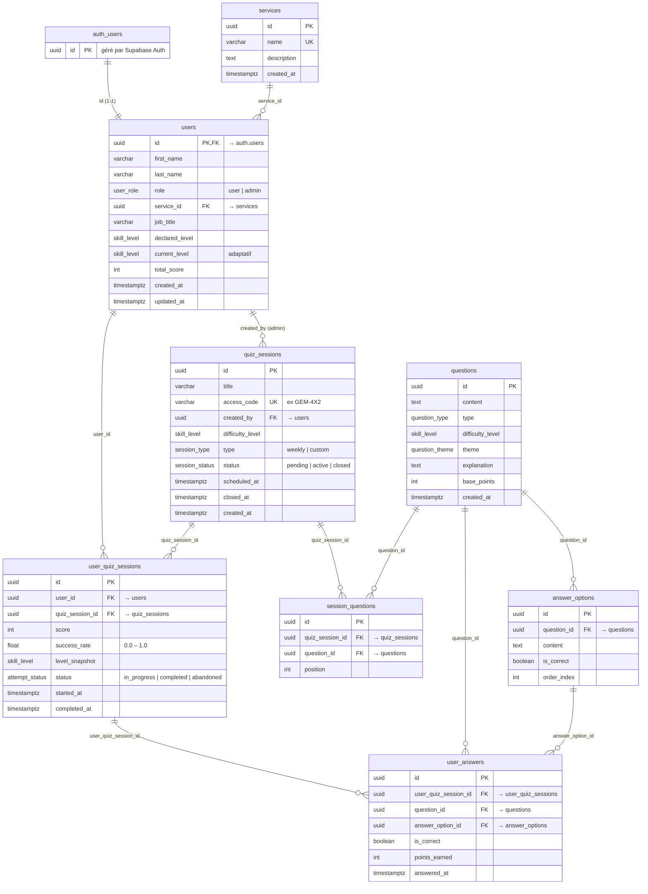

# Schéma de la base — IA Sensibilisation

Diagramme entité-association (ERD). Rendu graphique : aperçu Markdown de VS Code
(avec un plugin Mermaid), sur GitHub/GitLab, ou en collant le bloc sur
[mermaid.live](https://mermaid.live).

## Légende des relations

| Notation | Signification |
|----------|---------------|
| `\|\|--\|\|` | un-à-un (1-1) |
| `\|\|--o{` | un-à-plusieurs (1-N) |
| `PK` | clé primaire · `FK` clé étrangère · `UK` contrainte d'unicité |

## Vue dérivée (hors diagramme)

`daily_ranking` — **vue** (pas une table), calculée dynamiquement à partir de
`user_quiz_sessions` + `users` + `services` pour le classement quotidien
(global et par service).

## Types ENUM

- **user_role** : `user`, `admin`
- **skill_level** : `beginner` < `curious` < `expert`
- **session_type** : `weekly`, `custom`
- **session_status** : `pending`, `active`, `closed`
- **question_type** : `single_choice`, `multiple_choice`, `true_false`
- **question_theme** : `capacites`, `limites`, `dangers`, `ethique_societe`
- **attempt_status** : `in_progress`, `completed`, `abandoned`
